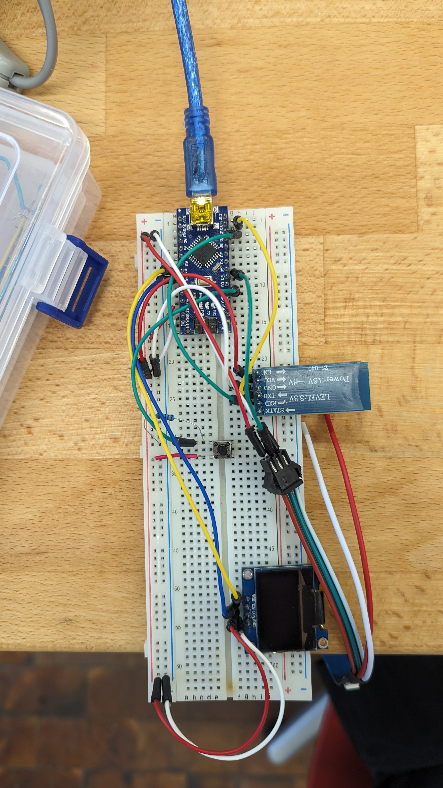

# Nano Bird

## Projektbearbeiter/in und betreuende Lehrkraft
- Raphael Ladinig
- Hannes Klotz

## Einleitung

Das Projekt "Nano Bird" zielt darauf ab, das Spiel Flappy Bird auf einem Arduino Nano mit einem OLED Display zu realisieren. Die Steuerung erfolgt über Knöpfe oder die Roboremo-App per Bluetooth. Ein LED-Streifen reagiert auf Events im Spiel.

## Projektbeschreibung

Flappy Bird wird auf einem Arduino Nano gespielt und auf einem OLED Display angezeigt. Die Steuerung erfolgt über Knöpfe oder per Bluetooth über die Roboremo-App. Ein LED-Streifen visualisiert Spielereignisse.

## Schaltplan/Diagramm

(LED-Streifen fehlt noch)

## Ergebnisse

Das Spiel Flappy Bird läuft erfolgreich auf dem Arduino Nano und wird klar auf dem OLED Display dargestellt. Die Steuerung funktioniert sowohl über Knöpfe als auch per Bluetooth über die Roboremo-App. Der LED-Streifen reagiert zuverlässig auf Spielereignisse. Herausforderungen wie die Bluetooth-Verbindung und die Synchronisation des LED-Streifens wurden gelöst.

## Fazit

Das Projektziel wurde erreicht. Flappy Bird funktioniert einwandfrei mit Knopf- und Bluetooth-Steuerung. Der LED-Streifen verbessert das Spielerlebnis. Für die Zukunft könnten zusätzliche Spielmechaniken und eine flüssigere Darstellung entwickelt werden. Das Projekt war insgesamt erfolgreich und lehrreich.
